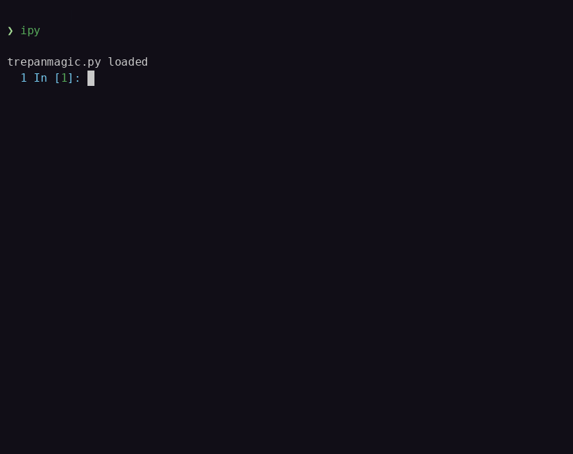

# Franky

   

A **GitHub-Dark-inspired** coding palette fused with the UI flavor of **Catppuccin-Mocha**. **Franky** works well alongside **Catppuccin** dark themes when the former are not available for a given application.

## Preview


## Installation

**Franky** comes with a Python installer. The preferred way to install the CLI is using [UV](https://docs.astral.sh/uv/):

```bash
uv tool install franky-theme
```

Alternatively, you can use [PIPX](https://pipx.pypa.io/stable/):

```bash
pipx install franky-theme
```

## Usage

Most themes are simple config files generated on demand by the CLI and installed in preconfigured locations. Some themes — like **IPython** — have a specific installation procedure.

```bash
$ franky install ghostty
```


### IPython Theme

**Franky-IPython** theme is available as an *extension* on **PyPi**. IPython typically stores its configurations in the `~/.ipython` directory. One way to provide this theme to IPython is by installing this *extension* under `~/.ipython/extensions/`. This can be done with **UV** as follows:

```bash
uv pip install --target="$HOME/.ipython/extensions" franky-ipython
```

Then add the following lines to `~/.ipython/profile_default/ipython_config.py`:

```python

import sys
from pathlib import Path

sys.path.append(str(Path.home() / ".ipython" / "extensions"))
c.InteractiveShellApp.extensions.append("franky_ipython")
```



## Roadmap

- [x] Bat
- [x] Delta
- [x] Ghostty
- [x] Helix editor
- [x] IPython shell
- [x] Qman
- [x] Yazi
- [ ] shell: LS_COLORS + man colors + ncurse colors
- [ ] Tmux
- [ ] Zellij
- [ ] Glow
- [ ] CSS
- [ ] Gtk.SourceView
- [ ] Gnome Shell

## Contributing

Contributors are always welcome. Feel free to grab an [issue](https://github.com/gravures/franky/issues) to work on or make a suggested improvement. If you wish to contribute, please read the [Contribution Guide](https://github.com/gravures/franky/blob/main/CONTRIBUTING.md) and [Code of Conduct](https://github.com/gravures/franky/blob/main/CODE_OF_CONDUCT.md). <!-- rumdl-disable-line MD013 -->

## License

Use of this repository is authorized under the [GPL-3.0](https://github.com/gravures/franky/blob/main/LICENSE).
