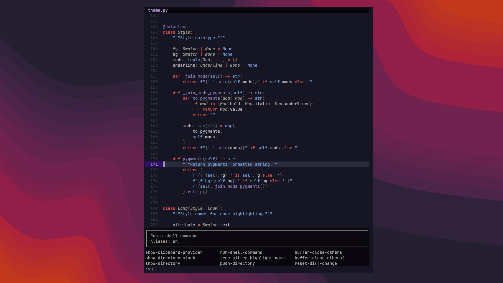

# Franky

[Python Version from PEP 621 TOML](https://img.shields.io/python/required-version-toml?tomlFilePath=https%3A%2F%2Fraw.githubusercontent.com%2Fgravures%2Ffranky%2Fmain%2Fpyproject.toml)   

**Franky** is a color scheme designed for coding, it start as the `catppuccin-mocha` theme
frankensteined with `github-dark` and a grain of salt of `rasmus`. So, **Franky** works
well next `catppuccin` dark themes.

## Preview



## Installation

```bash
uv tool install franky-theme
```

## Usage

```bash
$ franky install ghostty
the ghostty theme will be installed here:
  /home/gilles/.config/ghostty/themes/franky
accept? [Y/n]: y
theme for ghostty is now installed
```

## Road Map

- [x] Helix editor
- [x] Ipython shell
- [x] Ghostty
- [x] Qman
- [ ] shell: LS_COLORS + man colors + ncurse colors
- [ ] Yazi
- [ ] Delta
- [ ] Tmux
- [ ] Zellij
- [ ] Glow
- [ ] CSS
- [ ] Gtk.SourceView
- [ ] Gnome Shell

## Contributing

Contributors are always welcome. Feel free to grab an [issue](https://github.com/gravures/standard-deluxe/issues) to work on or make a suggested improvement. If you wish to contribute, please read the [Contribution Guide](https://github.com/gravures/standard-deluxe/contributing.md) and [Code of Conduct](https://github.com/gravures/standard-deluxe/code_of_conduct.md). <!-- rumdl-disable-line MD013 -->

## License

Use of this repository is authorized under the [GPL-3.0](https://github.com/gravures/standard-deluxe/LICENSE).
